# Sistem Logging Rekam Data Klinis Dalam Rumah Sakit Berbasis Blockchain

Disusun Oleh:

- 185150300111028 NOBEL EDGAR
- 185150300111029 DIONISIUS MARCELLO DIVITO
- 185150300111043 ALI ILHAM AINUR RAHMAN
- 185150301111016 MOCH. FEBRYANDANA NURFAHRI

## Daftar Isi

- [Sistem Logging Rekam Data Klinis Dalam Rumah Sakit Berbasis Blockchain](#sistem-logging-rekam-data-klinis-dalam-rumah-sakit-berbasis-blockchain)
  - [Daftar Isi](#daftar-isi)
  - [1. Deskripsi Proyek](#1-deskripsi-proyek)
  - [2. Perancangan Proyek](#2-perancangan-proyek)
  - [3. Implementasi Proyek](#3-implementasi-proyek)
  - [4. Pengujian Sistem](#4-pengujian-sistem)
    - [4.1. Pengujian Fungsionalitas](#41-pengujian-fungsionalitas)
    - [4.2. Pengujian Performansi](#42-pengujian-performansi)
    - [4.3. Pengujian Keamanan](#43-pengujian-keamanan)

## 1. Deskripsi Proyek

Dalam industri fasilitas kesehatan di Indonesia, setiap rumah sakit memberlakukan penyimpanan rekam medis dari pasien untuk keperluan manajemen pasien. Menurut Bali et al., penyimpanan jejak rekam medis merupakan hal yang sangat penting untuk dilakukannya evaluasi riwayat kondisi pasien serta bagian dari protokol perencananaan pengobatan pasien. Selain itu, disebutkan juga bahwa penyimpanan rekam medis juga digunakan untuk keperluan pengurusan asuransi, analisis statistik, dan bahkan bukti tuntutan malpraktek (Bali, 2011). Hal ini membuat manajemen data rekam medis merupakan suatu hal yang penting dalam industri fasilitas kesehatan.

Secara umum, data rekam medis hanya bisa diakses oleh fasilitas kesehatan dan pasien itu sendiri. Ada beberapa pengecualian, seperti orang tua dari pasien yang belum cukup umur (minor), dan kejaksaan ketika dihadapi kasus-kasus seperti malpraktek, kecelakaan, dan semacamnya (Bali, 2011). Namun pada umumnya, privasi merupakan hal yang sangat dijunjung dalam manajemen data rekam medis. Kementrian Kesehatan bahkan menetapkan regulasi di Peraturan Menkes No. 269/MENKES/PER/III/2008 yang menekankan rekam medis pasien sebagai barang rahasia yang hanya bisa ditulis oleh dokter dan pihak tenaga kesehatan.

Hingga saat ini, masih belum ada rumah sakit yang menerapkan teknologi Blockchain untuk digunakan sebagai media penyimpanan rekam medis. Hal ini sangat disayangkan karena teknologi Blockchain sendiri mampu menjamin keamanan data yang dimana hal ini merupakan titik perhatian paling besar dalam manajemen rekam medis pasien. Selain itu, teknologi Blockchain mengizinkan suatu fasilitas kesehatan untuk berbagi rekam medis dengan fasilitas kesehatan lainnya, yang akan sangat mempermudah untuk menjalankan peran utama adanya rekam medis sebagai evaluasi riwayat kondisi pasien serta bagian dari protokol perencanaan pengobatan pasien. Dengan sifat blockchain yang bersifat immutable, diajukan sebuah konsep ide yaitu integrasi rekam medis dengan menerapkan teknologi Blockchain sebagai solusi yang bisa menjawab kebutuhan industri fasilitas kesehatan di Indonesia.

## 2. Perancangan Proyek

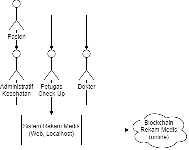

Sistem dirancang dengan asumsi ada empat aktor yang berinteraksi dengan sistem. Tiga aktor berinteraksi secara langsung dengan sistem, dan satu aktor berinteraksi secara pasif. Mengikuti regulasi Peraturan Menkes No. 269/MENKES/PER/III/2008, hanya dokter dan pihak tenaga kesehatan yang bisa mengisi data rekam medis. Hal ini membuat Pasien masuk ke dalam golongan aktor pasif dalam sistem yang dirancang. Pasien berinteraksi dengan dokter dan tenaga kesehatan untuk diambil datanya, dan data tersebut akan dimasukkan kedalam sistem melalui mereka.

Rancangan kasar dari sistem ini menerapkan aplikasi web yang berjalan pada jaringan lokal fasilitas kesehatan, dan terhubung dengan blockchain yang terhubung dengan awan (cloud). Hal ini dilakukan karena aplikasi tersebut perlu dipastikan agar hanya bisa diakses oleh dokter dan tenaga kesehatan, dan akan membatasi jumlah potensi peretas yang berusaha mencuri informasi dari sistem. Selain itu, setiap fasilitas kesehatan dapat memiliki database dokter dan petugas yang berbeda, sehingga tidak akan memperbesar kebutuhan penyimpanan untuk database diluar cakupan fasilitas kesehatan tersebut.

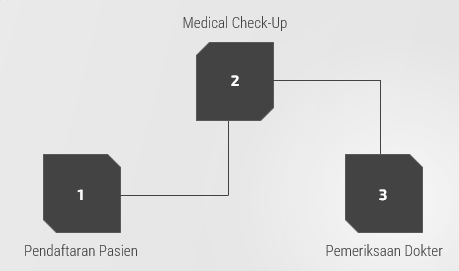

Alur kasar dari proses pengambilan rekam medis pasien digambarkan dengan tiga proses diatas. Proses dimulai dengan mendapatkan data identitas pasien serta keluhan yang dialaminya, yang akan direkam oleh aktor petugas administratif. Selain merekam data, petugas administratif akan mendaftarkan dokter yang harus dirujuk pasien berdasarkan kondisinya. Selanjutnya, pasien melakukan medical check-up, yang akan dicatat oleh aktor petugas tenaga kesehatan. Proses terakhir adalah konsultasi dengan aktor dokter yang dirujuk sebelumnya, yang dimana dokter akan memberikan hasil diagnosis serta preskripsi untuk kondisi pasien.

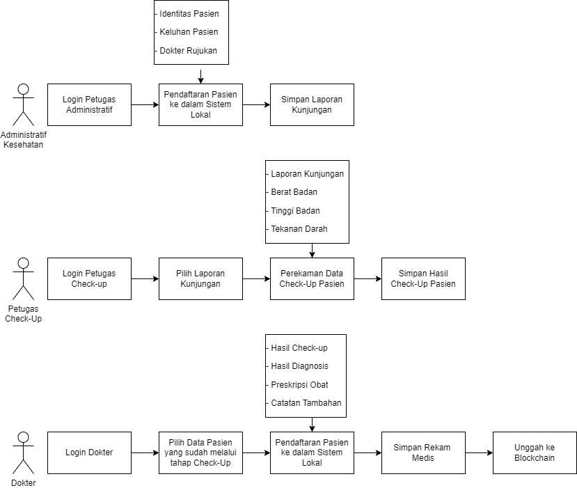

Alur penggunaan sistem sendiri dimulai dengan petugas administratif kesehatan melakukan login ke dalam akun pegawai masing-masing. Setelah melakukan proses login, petugas memasukan data-data yang dibutuhkan untuk mendaftarkan pasien ke dalam sistem web. Data-data yang dimaksud berupa identitas, keluhan, dokter yang dirujukkan untuk menangani keluhan tersebut. Setelah dimasukkan data-data tersebut, maka data disimpan dalam database lokal untuk diproses saat pasien masuk ke tahap selanjutnya. Pasien dialihkan ke tahap check-up di _nurse station_ untuk masuk ke tahap selanjutnya setelah proses administrasi selesai.

Selanjutnya, petugas check-up di _nurse station_ melakukan login ke akun pegawai masing-masing seperti yang dilakukan pada tahap selanjutnya. Setelah masuk ke dalam dasbor tampilan petugas checkup, petugas memilih laporan kunjungan yang sesuai dengan pasien yang datang ke _nurse station_. Pasien diikutsertakan dengan beberapa kegiatan pengecekan yang mencakup pengukuran berat badan, tinggi badan, dan tekanan darah pasien. Hasil dari check-up direkam ke dalam sistem. Setelah dilakukan keseluruhan proses, hasil disimpan ke dalam sistem lokal dan pasien diarahkan menuju ruang dokter yang dirujuk sebelumnya.

Dari sudut pandang Dokter, Dokter menerima pasien dan menangani keluhannya. Selagi mengurus pasien tersebut, dokter juga memilih pasien yang dihadapannya pada sistem web. Setelah didapatkan diagnosis dan pengobatan yang harus ditempuh pasien, dokter mencatat semua informasi tersebut pada sistem web. Ada tiga field yang bisa diisi, hasil diagnosisi, preskripsi obat, dan catatan tambahan jika dibutuhkan. Setelah dicatat, maka rekam medis pertemuan tersebut disimpan ke dalam sistem web, lalu diunggah ke dalam blockchain.

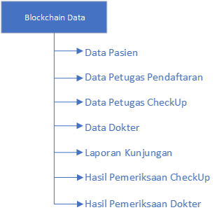

Pada blockchain yang digunakan, satu blok akan memiliki banyak informasi mengenai siapa pasien yang ditangani, siapa petugas yang menangani prosesnya, apa keluhannya, bagaimana kondisi tubuh dia, dan bagaimana hasil dari pemeriksaan dokter tersebut. Isi lengkap dari satu blok data dijabarkan sebagai berikut:

1. Data Pasien
   1. NIK
   2. Nama
   3. Tanggal Lahir
   4. Tempat Lahir
   5. Jenis Kelamin
2. Petugas Pendaftaran/Administratif
   1. NIK
   2. Nama
   3. Tanggal Lahir
   4. Tempat Lahir
   5. Jenis Kelamin
   6. Kode Pegawai
3. Petugas Check-up
   1. NIK
   2. Nama
   3. Tanggal Lahir
   4. Tempat Lahir
   5. Jenis Kelamin
   6. Kode Pegawai
4. Dokter
   1. NIK
   2. Nama
   3. Tanggal Lahir
   4. Tempat Lahir
   5. Jenis Kelamin
   6. Kode Pegawai
   7. Spesialisasi
5. Laporan Kunjungan
   1. Nomor Kunjungan
   2. Keluhan Pasien
6. Hasil Check-up
   1. Berat Badan
   2. Tinggi Badan
   3. Tekanan Darah
7. Hasil Pemeriksaan Dokter
   1. Hasil Diagnosis Dokter
   2. Preskripsi Obat untuk Diagnosis tersebut
   3. Catatan Tambahan

Blockchain disusun dengan menggabungkan data yang disimpan pada keseluruhan tahap penyimpanan dan digabung menjadi satu kesatuan untuk digabungkan dengan data-data pasien lainnya, menjadikannya satu kesatuan sistem blockchain.

## 3. Implementasi Proyek

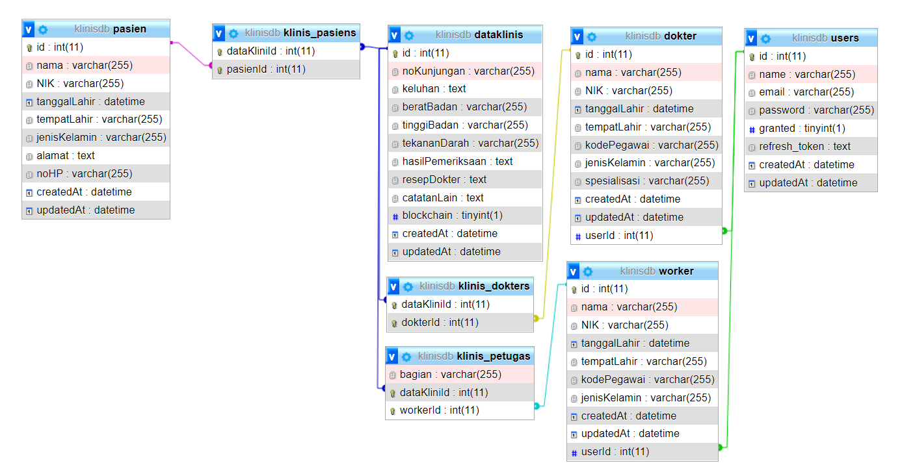
Database SQL digunakan untuk menyimpan data-data user pengguna serta catatan klinis sebelum nantinya diupload kedalam blockchain. Terdapat 8 table yang digunakan, untuk menympan data dari para petugas, dokter, catatan klinis dan pasien. Table users merupakan table dengan relasi one-to-one dengan table dokter dan worker. Untuk table data klinis memiliki relasi many-to-many dengan dokter melalui table klinis_dokter, dengan table petugas melalui klinis_petugas, serta pasien melalui klinis_pasien.

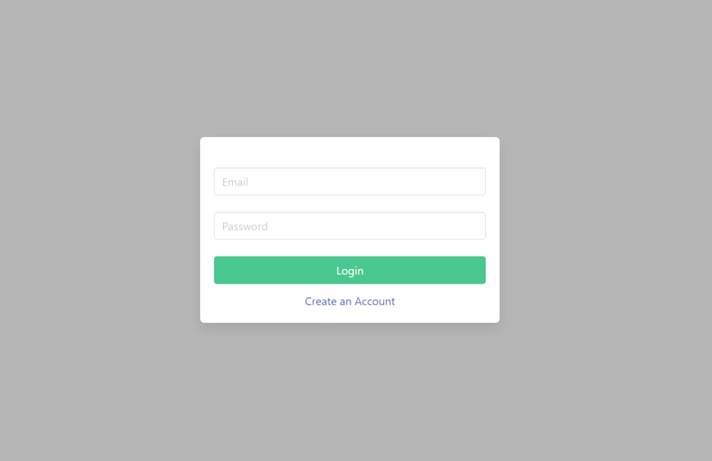
Saat membuka web, sistem dihadapkan dengan tampilan halaman login. Petugas di fasilitas kesehatan melakukan proses login ke dalam akun pribadi masing-masing sesuai dengan email dan password yang didaftarkan sebelumnya.

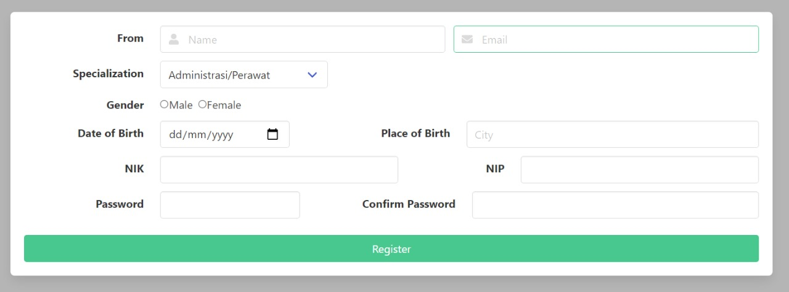
Jika seorang petugas kesehatan belum memiliki akun, petugas dapat melakukan login, yang akan menampilkan tampilan sebagai berikut. Nama dan email dapat dimasukan, serta spesialisasi, jenis kelamin, tempat tanggal lahir, NIK, NIP, dan password yang digunakan. Hanya petugas kesehatan yang dapat melakukan proses registrasi, dilihat dengan keberadaan NIP dalam tahap registrasi.

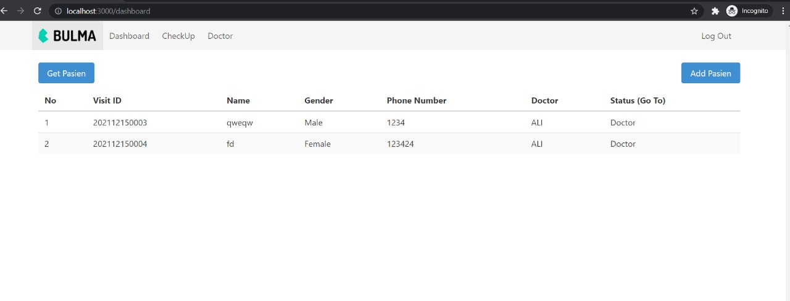
Pada halaman dasbor, bisa dilihat list pasien yang terdaftar di rumah sakit. Untuk menambahkan pasien bisa mengunakan tombol tambah pasien, yang bisa dilakukan oleh peran petugas administrasi.

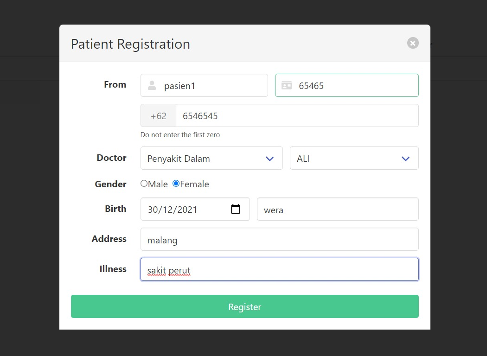
Pada halaman pendaftaran bisa mendaftarkan Nama, NIK, Nomor Telepon, Jenis Kelamin, Tempat Tanggal Lahir, Alamat, dan Keluhan Kondisi. Selain itu, pasien langsung ditentukan siapa dokter yang menangani kasus ini pada halaman awal.

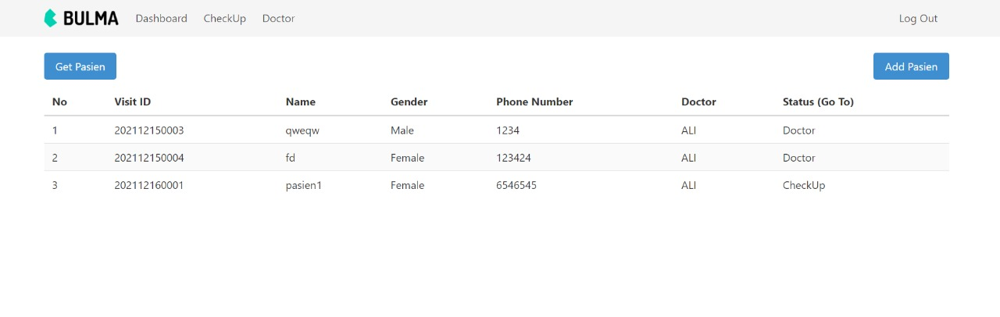
Berikut merupakan tampilan dasbor yang sudah ditambahkan oleh pasien. Bisa dilihat bahwa pada bagian status, tulisannya berupa Checkup, sehingga masuk ke tahap medical checkup.

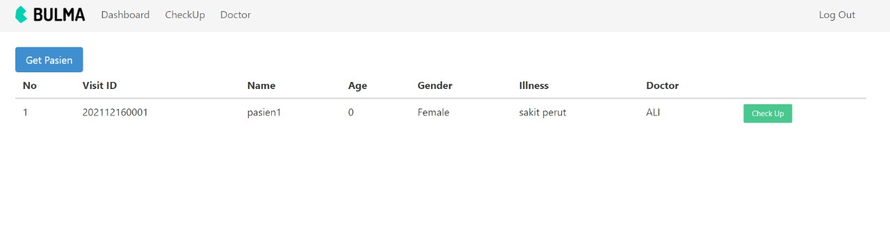
Berikut merupakan tampilan dasbor pada bagian checkup. Petugas checkup mampu mengakses halaman ini dan menekan tombol Checkup untuk menambahkan informasi yang didapat pada tahap checkup.

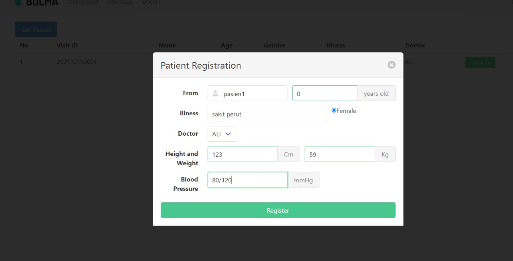
Pada tahap ini, bisa dilihat bahwa muncul opsi untuk mengisi nilai pada Height, Weight, dan Blood Pressure. Tiga nilai ini diisi oleh data yang didapatkan dari pengukuran. NIlai-nilai yang lainnya tidak bisa diubah karena mengikuti input data dari tahap pendaftaran.

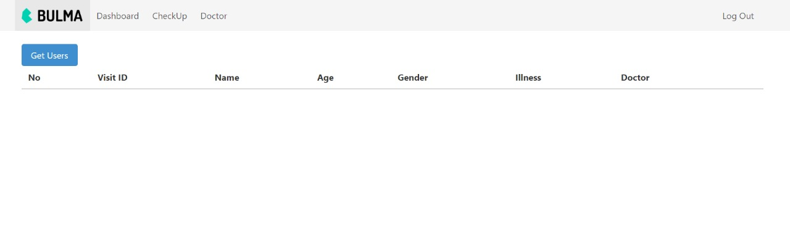 Pada tampilan dokter hampir sama seperti dasbor pada lainnya, namun ada tambahan button untuk menambahkan hasil, preskripsi obat, dan catatan tambahan.

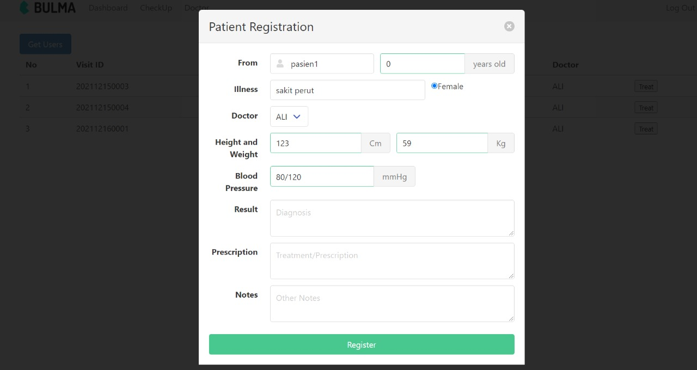 Bisa dilihat ada tiga text box yang digunakan untuk mengisi hasil, preskripsi obat, dan catatan tambahan. Sama seperti form pendaftaran sebelumnya, poin-poin pada sebelumnya tidak bisa diubah karena mengikuti hasil dari pendaftaran dan checkup.

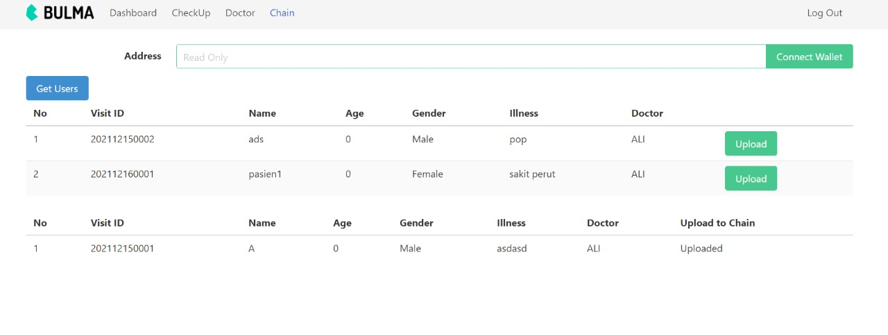
Berikut merupakan tampilan pada tampilan Chain. Untuk mengunggah ke Blockchain, bisa dilakukan dengan menekan tombol Upload di tabel atas. Sistem akan mengupload nilai pada blockchain target.

## 4. Pengujian Sistem

### 4.1. Pengujian Fungsionalitas

Tautan berdasar admin, petugas, dan dokter.

**1. Admin**

Admin memiliki akses kebeberapa tautan, dan tautan khusus untuk admin adalah pada tautan chain dan admin. Tautan Chain digunakan untuk mengupload data kepada blockchain, dan tautan admin untuk memberikan akses pada users. Admin tidak memiliki tautan dokter karena sifatnya yang hanya dikhusukan untuk dokter.

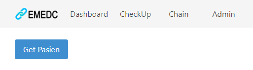

**2. Petugas**

Petugas memiliki dua buah navigasi pada dashboard yaitu untuk melakukan pendaftaran dan checkup untuk memasukkan data klinis dasar seperti berat dan tinggi badan serta tekanan darah.

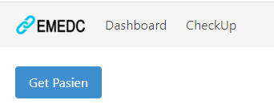

**3. Dokter**

Dokter memiliki tiga buah navigasi, navigasi pendaftaran dan checkup hanya untuk melihat antrian, sedangkan pada bagian navigasi doctor untuk melihat pasien yang ingin melakukan pemeriksaan pada doctor tersebut serta memberikan hasil laporan pada sistem.

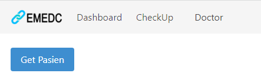

### 4.2. Pengujian Performansi

**Waktu Komputasi Blockchain**

Pengujian dilakukan secara lokal dengan menggunakan ganache dan metamask, selain itu pengujian dilakukan setelah terdapat block pada chain sejumlah 15 dan diuji setelahnya sebanyak 10 kali. Penggunaan create dilakukan dengan adanya human interface dengan metamask, dan pada read dilakukan dengan membaca keseluruhan data pada chain. Hasil pengujian didapatkan seperti pada table dibawah.

| No        | Create(ms) | Read(ms) |
| :-------- | :--------: | -------: |
| 1         |    8576    |     1695 |
| 2         |    9720    |     1654 |
| 3         |    8253    |     1887 |
| 4         |    8318    |     2022 |
| 5         |    8309    |     2162 |
| 6         |    7828    |     2248 |
| 7         |    7928    |     2342 |
| 8         |    9120    |     2463 |
| 9         |    9266    |     2578 |
| 10        |    9389    |     2786 |
| Rata-rata |    8670    |     2183 |

### 4.3. Pengujian Keamanan

**1. Login**

Untuk masuk ke dalam web dibutuhkan login, dan email/users yang terdaftar harus mendapatkan permission terlebih dahulu. Jika tidak mendapatkan permission maka akan muncul notifikasi "email not found".

Jika terjadi seperti diatas maka user harus diberi izin melalui akun admin. Merubah status izin dari pending menjadi Granted.

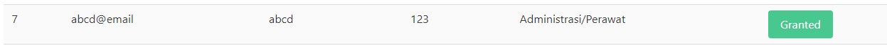

**2. JSON Web Token**

Penggunaan JWT digunakan untuk mengenkripsi data user yang dikirim ke frontend, selain itu sebagai keamanan akses database, pembatas waktu user dapat berinteraksi dan juga waktu saat web tidak digunakan. Interaksi user dengan web bisa dilakukan selama 30 menit kecuali terdapat event tertentu untuk merefresh token akses.

Saat API dipanggil dan tidak terdapat token authoriztion maka akan mendapatkan kembalian berupa status Unauthorized (401)

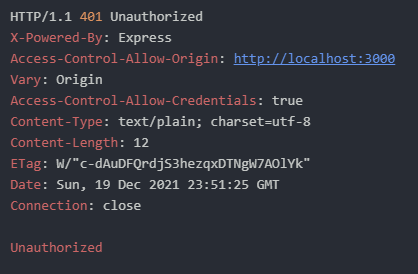

Jika API dipanggil dan memliki token authorization tetapi waktu telah lebih dari 30 menit maka akan mendapatkan kembalian status Forbidden (403)

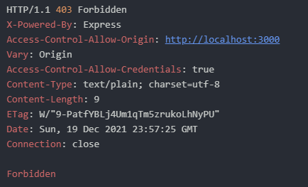
